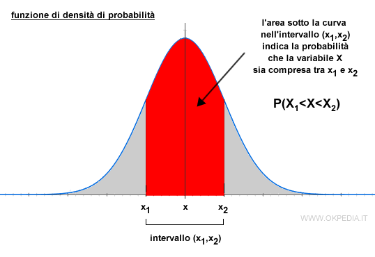
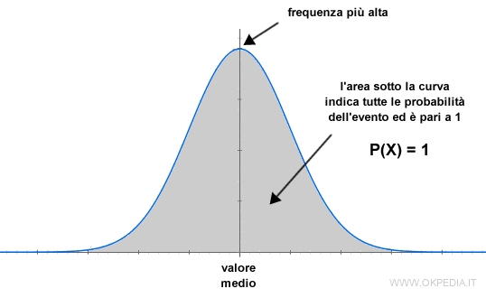
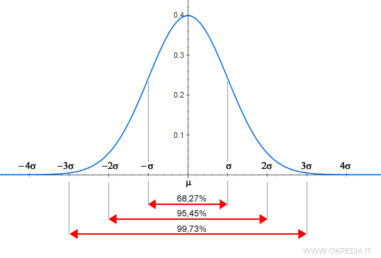
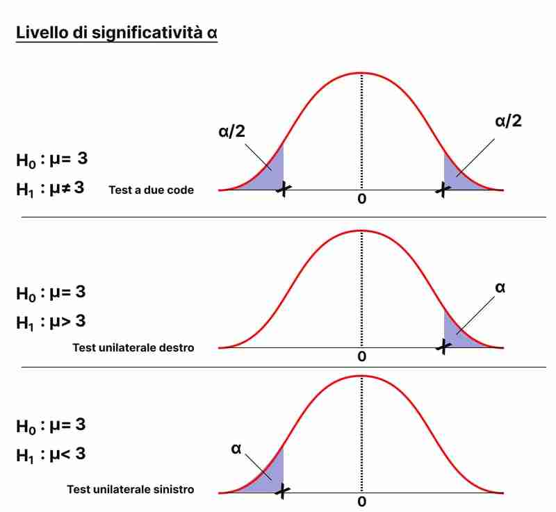
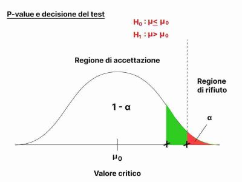
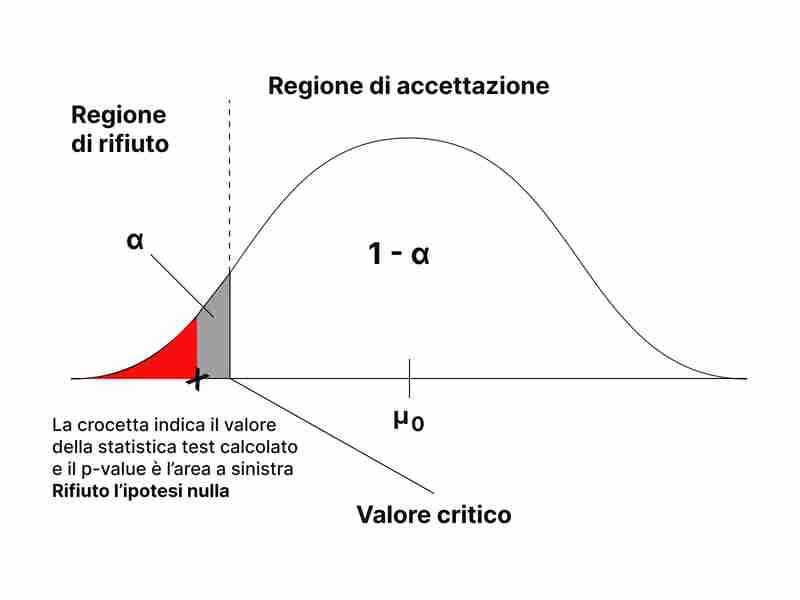
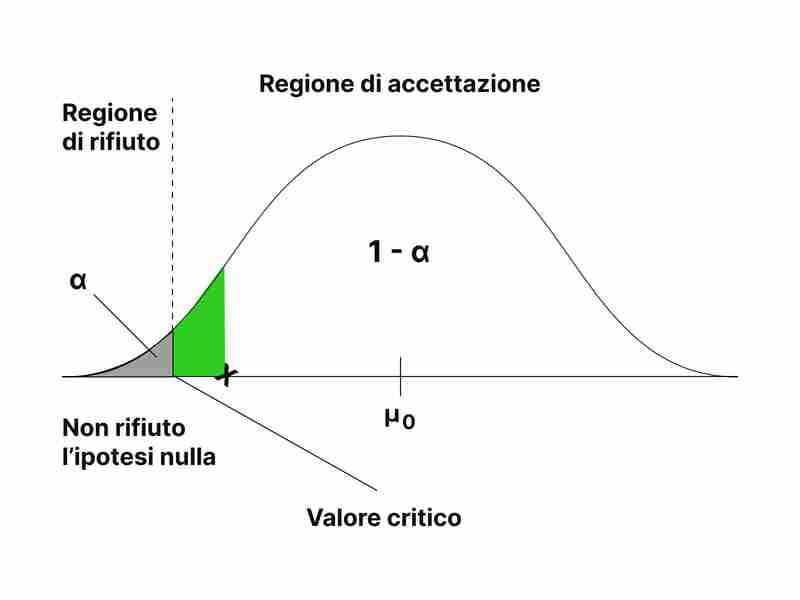

```{r setup, include=FALSE}
knitr::opts_chunk$set(echo = TRUE)
```

# Seconda parte

**Installazione delle librerie e importazione del dataset**

```{r}
#ci permette di rappresentare graficamente i dati
library(ggplot2)

data(mpg)
```

# Introduzione

L'indagine statistica è sempre effettuata su un insieme di entità (individui, oggetti,. . .) su cui si manifesta il fenomeno che si studia. Questo insieme è detto popolazione o universo e può essere costituito da un numero finito oppure infinito di unità; nel primo caso si parla di *popolazione finita*, nel secondo caso di *popolazione illimitata*. La conoscenza delle caratteristiche di una popolazione finita può essere ottenuta osservando la totalità delle entità della popolazione oppure un sottoinsieme di questa, detto campione estratto dalla popolazione. Una popolazione illimitata può invece essere studiata soltanto tramite un campione estratto.

L'analisi dei fenomeni avviene attraverso l'uso dell'*inferenza*, una branca della statistica che si comporta in modo opposto alla probabilità:

-   nella probabilità dato un processo che genera i dati ci chiediamo quale è la probabilità dell'evento

-   nell'inferenza dato un risultato ci chiediamo cosa posso dire sul processo che ha generato i dati

L'inferenza statistica si basa su due metodi fondamentali di indagine:

-   la stima dei parametri

-   la verifica delle ipotesi.

## Variabili aleatorie continue

Una variabile aleatoria è continua se può assumere tutti i valori compresi in un (qualsiasi) intervallo reale. Formalmente, una v.c. continua X *assume un insieme continuo di valori con una densità di probabilità* $f_X(x)$, è una funzione misurabile e a valori reali che assegna ad ogni evento di uno spazio di probabilità continuo un numero reale.

Le v.c. continue presentano una maggiore complessità analitica poiché per esse non è possibile elencare tutti i valori che la v.c. assume, essendo questi una infinità non numerabile. Occorre quindi assegnare la probabilità ad intervalli sulla retta e derivare,poi, da tale assegnazione tutte le probabilità degli eventi che interessano.

Una v.c. continua X è nota se, per ogni $x_0$ reale e prefissato, è nota la probabilità che tale v.c. assuma un valore in un intervallo di ampiezza infinitesimo rispetto a $x_0$ mediante la relazione seguente:

$$P_r(x_0 < X \leq x_0 + d_x) = f(x_0)dx$$

dove $f(x)$ è una funzione a valori reali, detta *funzione di densità* della v.c. continua X. Spesso, scriveremo: $X \sim f(x)$ per indicare che la v.c. X possiede $f(x)$ come propria funzione di densità.



La probabilità che la v.c X assuma valori nell'intervallo raffigurato è uguale a $f(x)dx$ perchè essa è uguale all'aerea del rettangolo la cui base misura $dx$ e la cui altezza è $f(x_0)$, perchè per la continuità deve essere: $f(x_0) = f(x_0 + dx)$.

**La funzione di ripartizione** (o cumulativa) *di una variabile casuale continua è una funzione matematica che descrive la probabilità che la variabile casuale assuma un valore minore o uguale ad un certo valore* nel nostro caso la *funzione di ripartizione* $F(x_0)$ di una variabile casuale X continua calcolata nel punto $x_0$ è:

$$F(x_0) = Pr(X \leq x_0) = \int^{x_0}_{-\infty} f(w)d_w$$

Il sistema R mette a disposizione per ciascuna delle principali variabili aleatorie continue:

• la funzione di probabilità indicata con *d* che calcola la funzione di probabilità di una variabile aleatoria in uno specifico punto o in un insieme di punti (density mass).

• la funzione di distribuzione indicata con *p* che calcola la funzione di distribuzione di una variabile aleatoria in uno specifico punto o in un insieme di punti (probability distribution).

• la funzione per calcolare i quantili indicata con *q* che calcola i quantili.

• la funzione che simula la variabile aleatoria mediante la generazione di sequenze di numeri pseudocasuali indicata con *r* che simula una variabile aleatoria generando una sequenza di numeri pseudocasuali.

Tra le variabili casuali continue rientrano: Uniforme, Esponenziale, Normale, Chi-quadrato, T di student.

In questo progetto analizzeremo a fondo la ***variabile casuale continua Normale***.

## Variabile casuale normale

La v.c. Normale è di gran lunga la distribuzione più importante del Calcolo delle probabilità e della Statistica, al punto che appare difficile immaginare lo sviluppo di tali discipline senza riconoscere ad essa un ruolo centrale. La sua stessa denominazione (*normale* suggerisce che essa è la "norma") esplicita che la sua presenza nelle applicazioni e negli sviluppi teorici è quasi una regola. In effetti, la v.c. Normale approssima la distribuzione empirica di moltissimi fenomeni reali, ma è anche punto di riferimento per stabilire confronti, dedurre risultati asintotici, ecc...

-   La sua introduzione nella storia della probabilità è legata alla ricerca della distribuzione degli errori accidentali. Galileo descrisse con precisione, sin dal 1632, le caratteristiche essenziali che una distribuzione degli errori doveva possedere nel "dialogo dei massimi sistemi" ma non si preoccupò di derivarne la forma analitica.

-   La prima apparizione della funzione di densità della v.c. Normale avviene nel 1733 ad opera di *De Moivre* che la utilizza come approssimazione alla somma di v.c. Binomiali. Negli anni 1770-71 Daniel Bernoullli fornisce la prima tavola della funzione di densità mentre Laplace a partire dal 1810 la ritrova nei Teoremi Limite Centrale.

-   Nel 1809 Gauss pubblica la "Theoria Motus Corporum Coelestium" dove utilizza la v.c. Normale nell'ambito del principio dei minimi quadrati e del metodo della massima verosimiglianza. Gauss in tale opera dichiara di aver utilizzato questi risultati sin dal 1795. Questa affermazione, e l'autorità indiscussa di Gauss nell'ambito delle scienze matematiche, hanno indotto a definire la v.c. Normale come v.c. di Gauss o v.c. Gaussiana.

-   Grazie ai Teoremi Limite Centrale, e alle interpretazioni estensive che ne furono date, la v.c. Normale non fu applicata alle sole misurazioni fisiche. Quételet nel 1846 la utilizzò per studi antropometrici, Maxwell nel 1860 per la teoria cinetica dei gas, Galton nel 1889 per lo studio dei fenomeni naturali e biologici. Quindi a partire dagli inizi del 1900, Student, Pearson e Fisher posero le basi inferenziali della Statistica mediante il campionamento, la stima e il test soprattutto per popolazioni estratte da v.c. Normali e derivarono quelle distribuzioni notevoli, esatte o asintotiche, che oggi utilizziamo.

*A titolo di curiosità, si può ricordare che la funzione di densità della v.c. Normale è l'unica formula matematica che, nella storia, sia stata impressa su una banconota con ampia circolazione.*

La distribuzione normale è una distribuzione continua, ciò significa che può assumere qualsiasi valore all'interno di un intervallo specifico, anziché solo valori discreti. La distribuzione normale è descritta da una curva a campana, con la maggior parte dei valori concentrati intorno alla media e i valori estremi che diventano meno probabili man mano che ci si allontana dalla media (cioè man mano si va verso le code).

La media (o la mediana) di una distribuzione normale è il valore centrale della distribuzione e rappresenta il valore più probabile. La deviazione standard è una misura della dispersione dei dati intorno alla media. La distribuzione normale standard ha una media di 0 e una deviazione standard di 1.



La distribuzione normale ha molte proprietà utili, tra cui:

-   La somma di molte variabili casuali indipendenti normalmente distribuite è normalmente distribuita.

-   La distribuzione normale è una distribuzione di probabilità stabile, cioè una piccola quantità di dati casuali può essere utilizzata per stimare i parametri della distribuzione.

-   La distribuzione normale è utilizzata come base per un gran numero di test statistici, come test t, analisi di varianza, analisi dei componenti principali.

La distribuzione normale è utilizzata in molte applicazioni, tra cui:

-   Modelli di previsione basati sull'inferenza statistica, come la previsione del tempo o del prezzo delle azioni

-   Modelli di simulazione, come la simulazione delle prestazioni delle attrezzature o del traffico

-   Modelli di stima, come l'analisi delle risposte a un questionario

-   Modelli di ottimizzazione, come il calcolo del prezzo di un'opzione

-   La distribuzione normale è spesso considerata un buon modello per variabili fisiche come peso, altezza, temperatura, voltaggio, livello di inquinamento, per analizzare gli errori di misurazione ed anche per descrivere il reddito familiare o voti degli studenti.

Una v.c. *X* continua si dice v.c. Normale (oppure v.c. Gaussiana) con parametri $\mu$ ,per indicare la media, e $\sigma^2$ , per indicare la varianza, la si indica con $X \sim N(\mu, \sigma^2)$, se è definita su tutto l'asse reale inoltre la funzione di densità di probabilità è:

$$
f_x(x) = \frac{1}{\sqrt{2\pi \sigma^2}} e^{(-\frac{1}{2} \frac{(x-\mu)^2}{\sigma^2})}
$$

con $- \infty < x < \infty$

Poiché il parametro $\mu$ può assumere qualsiasi valore reale mentre il parametro $\sigma^2$ può solo essere non negativo, lo spazio parametrico di questa v.c. è il semipiano positivo, cioè:

$$\Omega(\mu,\sigma^2) = {(\mu,\sigma^2): -\infty < \mu < +\infty; 0 \leq \sigma^2 < +\infty} $$

Lo studio analitico della funzione di densità di una v.c. Normale mostra che essa ha una forma campanulare simmetrica rispetto al suo valore medio (punto di ascissa $x=\mu$ ), in corrispondenza del quale si presenta il massimo ovvero $f(x)=\frac{1}{\sigma\sqrt{2 \pi}}$. Quindi, il parametro $\mu$ è la moda, la mediana e il valore medio della v.c. *X*. Utilizzando le derivate seconde, si dimostra che $f(x)$ presenta due flessi equidistanti dal punto $x=\mu$ in corrispondenza delle ascisse $x = \mu \pm \sigma$. Inoltre, $f(x) -> 0$ per $x -> \pm \infty$, cioè l'asse x è un asintoto orizzontale per tale funzione.

Se, a parità di $\sigma^2$, si modifica il valore medio $\mu$, allora la funzione di densità della v.c. subisce una traslazione lungo l'asse x.

Invece al crescere di $\sigma^2$, a parità di $\mu$ i flessi si allontanano dalla media, dunque da ($\mu$) , e la funzione di densità attribuisce una maggiore probabilità che la v.c. assuma valori attorno al valore medio $\mu$.

Infine quando $\sigma^2 -> 0$, la distribuzione della v.c. Normale tende a divenire degenere perchè assume, con probabilità 1, valori infinitamente vicini a $x=\mu$.

I momenti caratteristici della v.c. Normale risultano uguali a:

$$
E(X) = \mu; Var(X) = \sigma^2; Asym(X) = 0; Kurt(X)=3
$$

### Funzione di probabilità

In R la densità normale si calcola attraverso la funzione:

```{r fig.align = 'center'}
curve(dnorm(x,mean =0, sd =1), from =-6, to=6, xlab="x", ylab="f(x)", lty =1, 
      main = "Densità normale standard")

```

dove:

-   x sono i valori assunti dalla variabile aleatoria normale;
-   mean e sd sono il valore medio e la deviazione standard della densità normale standard.

### Quantili

In R si possono calcolare anche i quantili (percentili) della distribuzione normale attraverso la funzione (l'esempio è svolto con la normale standard):

```{r}
z<-c(0 ,0.25 ,0.5 ,0.75 ,1)
qnorm(z, mean = 0, sd = 1)

```

-   Primo quartile: -0.67
-   Secondo quartile (media e mediana): 0
-   Terzo quartile: 0.67
-   Max = inf, Min = -inf

### Variabile aleatoria normale

È possibile simulare in R la variabile aleatoria normale generando una sequenza di numeri pseudocasuali mediante la funzione:

```{r fig.align = 'center'}
v_c <- rnorm(n = 100, mean = 0, sd = 1)
hist(v_c, main = "Variabile casuale", xlim = c(-3,3), xlab = "valori pseudocasuali")

```

dove:

\- n è la lunghezza della sequenza da generare;

\- mean e sd sono il valore medio e la deviazione standard della densità normale;

### Confronto tra valori medi differenti

Variazioni del parametro $\mu$ comportano traslazioni della curva lungo l'asse delle ascisse; infatti, al crescere del parametro $\mu$ la curva si sposta lungo l'asse delle ascisse senza cambiare forma, ecco un esempio:

```{r fig.align='center', paged.print=TRUE}
curve(dnorm(x,mean =-2, sd =1), from =-6, to=6, 
      xlab="x", ylab="f(x)", lty =1, col = "blue")

curve(dnorm(x,mean =0, sd =1), from =-6, to=6, 
      xlab="x", ylab="f(x)", lty =1, add = TRUE)

curve(dnorm(x,mean =2, sd =1), from =-6, to=6, 
      xlab="x", ylab="f(x)", lty =1, 
      add= TRUE, col = "red")

```

Nel grafico la curva di colore rosso ha un valore di $\mu=2$ (pari a due) ed è traslata verso destra rispetto alla curva di partenza, invece la curva di colore blu ha $\mu=-2$ dunque negativo infatti è spostata verso sinistra.

### Confronto tra deviazioni standard differenti

Il parametro $\sigma$, pari alla semiampiezza tra i due punti di flesso, caratterizza invece la larghezza della funzione.

```{r fig.align = 'center'}
curve(dnorm(x,mean =0, sd =1), from =-6, to=6, 
      xlab="x", ylab="f(x)", lty =1, col = "blue")

curve(dnorm(x,mean =0, sd =3), from =-6, to=6, 
      xlab="x", ylab="f(x)", lty =1, add = TRUE)

curve(dnorm(x,mean =0, sd =5), from =-6, to=6, 
      xlab="x", ylab="f(x)", lty =1, add= TRUE, col = "red")

```

All'aumentare del valore di $\sigma$ la curva tende a diventare più piatta, infatti la curva di colore rosso che ha $\sigma=5$ è di gran lunga più schiacciata rispetto a quella di colore blu con $\sigma=1$, se, invece, il valore di $\sigma$ diminuisce la curva si allungherà verso l'alto restringendosi contemporaneamente ai lati.

### Variabile casuale normale standardizzata

Una variabile aleatoria normale standard, solitamente denotata con Z, può essere ottenuta da una variabile aleatoria normale non standard $X \sim N(\mu, \sigma)$ standardizzando, ossia sottraendo il valore medio e dividendo per la deviazione standard: $$Z = \frac{X-\mu}{\sigma}$$ da cui segue $X = \mu + \sigma Z$.

Dunque $Z \sim N(0,1)$ è la v.c. *Normale standardizzata,* ossia una normale con valore medio nullo e varianza unitaria, la cui funzione di distribuzione è $\Phi(z)$: $$
\Phi(z) = 
\frac{1}{\sqrt{2\pi}}
\int^z_{-\infty} e^{-\frac{y^2}{2}}d_y
$$

La funzione di distribuzione della v.c. *Z* non ammette una formulazione esplicita, per cui è stato necessario predisporre delle tavole che, per opportuni valori di z forniscano l'integrale $\Phi(z)$ con sufficiente accuratezza.

### Regola del 3 $\sigma$

La regola del 3 sigma, nota anche come regola empirica o regola dei tre sigma, è un concetto statistico che descrive la distribuzione di una variabile casuale normale o gaussiana. La regola afferma che circa il 68% dei dati si trova entro un intervallo di un sigma (standard deviation) dalla media, circa il 95% si trova entro un intervallo di due sigma dalla media, e circa il 99,7% si trova entro un intervallo di tre sigma dalla media.

In altre parole, se si assume che una variabile casuale segua una distribuzione normale, si può aspettare che la maggior parte dei dati si concentri intorno alla media, e che l'ampiezza della distribuzione diminuisca man mano che ci si allontana dalla media. Il valore di sigma rappresenta la dispersione dei dati attorno alla media, e una maggiore dispersione indica una distribuzione più ampia.

La regola del 3 sigma può essere utile per la valutazione della precisione di una misura o per la rilevazione di eventuali valori anomali nella distribuzione dei dati. Ad esempio, se si osserva un valore che si trova a più di tre sigma dalla media, potrebbe essere considerato come un valore anomalo o "outlier" che richiede ulteriori indagini.

Per una qualsiasi variabile aleatoria normale $X \sim N(\mu, \sigma)$ risulta:

$$P(\mu - 3\sigma < X < \mu + 3\sigma) = P(-3 < \frac{X-\mu}{\sigma} < 3)= P(-3 < Z <3)=0.99$$

Quindi la probabilità che una variabile aleatoria $X \sim N(\mu, \sigma)$ assuma valori in un intervallo avente come centro $\mu$ e semiampiezza $3\sigma$ è prossima all'unità. Questa proprietà delle variabili aleatorie normali è nota come regola del $3\sigma$.

Per un ulteriore dimostrazione sostituiamo i valori dell'espressione con $\mu =0$ e $\sigma=1$:

```{r}
pnorm(3, mean = 0, sd = 1) - pnorm(-3, mean=0, sd = 1)

```



## Stima puntuale

### Campioni casuali e stimatori

Gli stimatori sono delle funzioni matematiche che utilizzano i dati del campione per fornire informazioni sulla popolazione di origine. Esistono diversi tipi di stimatori, come:

-   gli stimatori puntuali, che forniscono un valore preciso per un parametro della popolazione

-   gli stimatori intervallari, che forniscono un intervallo di valori in cui si presume che si trovi il valore del parametro.

L'accuratezza degli stimatori dipende dalla dimensione del campione e dalla distribuzione dei dati nella popolazione.

Per ottenere informazioni sui parametri non noti della popolazione, si può fare uso dell'inferenza statistica, considerando un campione estratto dalla popolazione ed effettuando su tale campione delle opportune misure. Affinché le conclusioni dell'inferenza statistica siano valide il campione deve essere scelto in modo da essere rappresentativo della popolazione. Molti metodi dell'inferenza statistica sono basati sull'ipotesi di campioni casuali.

### **Definizione di campione casuale**

I campioni casuali sono un concetto fondamentale nell'ambito della statistica e della ricerca scientifica in generale. In pratica, un campione casuale rappresenta un sottoinsieme selezionato casualmente da una popolazione più grande. L'obiettivo principale dell'utilizzo di campioni casuali è quello di ottenere informazioni sulla popolazione di riferimento, in modo da poter fare inferenze e prendere decisioni sulla base di queste informazioni. I campioni per definirsi tali devono godere della proprietà "iid" (indipendente e identicamente distribuita) è un'importante caratteristica dei dati del campione casuale, che indica che ciascuna osservazione nel campione è indipendente dalle altre e viene selezionata dalla stessa distribuzione di probabilità della popolazione madre. Ciò significa che le osservazioni nel campione sono selezionate in modo casuale e non influenzate da alcuna caratteristica della popolazione madre. Inoltre, ogni osservazione nel campione ha la stessa probabilità di essere selezionata come qualsiasi altra osservazione, il che garantisce che il campione sia rappresentativo della popolazione da cui è stato estratto.

### Stimatori

*Ogni volta che una statistica campionaria è usata per stimare un parametro, viene chiamata stimatore.*

Statistiche tipiche sono la media campionaria e la varianza campionaria.

**Media campionaria è:**

$$\overline X = \frac{1}{n}\sum_{i=1}^n X_i$$

**Varianza campionaria è:**

$$S^2 = \frac{1}{n-1} \sum^n_{i=1}(X_i - \overline X)^2$$

### Stima dei parametri

La stima dei parametri ha lo scopo di determinare i valori non noti di una popolazione (come il valore medio, la varianza,. . .) per mezzo dei corrispondenti parametri derivati dal campione estratto dalla popolazione (come la media campionaria, la varianza campionaria,. . .).

Si possono usare *stime puntuali* o *stime per intervallo*.

La stima puntuale è una tecnica di inferenza statistica che permette di stimare un parametro di interesse, come ad esempio la media o la varianza di una popolazione, a partire da un campione di osservazioni. In altre parole, la stima puntuale consiste nel calcolare un valore numerico che rappresenta la nostra migliore previsione del valore del parametro.

La stima puntuale si basa sul fatto che, se il campione è rappresentativo della popolazione, le caratteristiche del campione dovrebbero essere simili a quelle della popolazione. Ad esempio, se si vuole stimare la media della popolazione, si può calcolare la media campionaria e utilizzarla come stima puntuale della media della popolazione.

Tuttavia, la stima puntuale non fornisce informazioni sulla precisione o l'accuratezza della stima. In altre parole, non ci dice quanto vicino sia il valore stimato al valore vero del parametro. Per questo motivo, spesso è utile accompagnare la stima puntuale con un intervallo di confidenza, che indica la probabilità che il vero valore del parametro si trovi entro un certo intervallo intorno alla stima puntuale.

Alla stima puntuale di un parametro non noto di una popolazione (costituita da un unico valore) spesso si preferisce sostituire un intervallo di valori, detto intervallo di confidenza, ossia si cerca di determinare in base al campione osservato $(x_1, x_2, ..., x_n)$ due limiti (uno inferiore e uno superiore) entro i quali sia compreso il parametro non noto con un certo grado di confidenza, detto anche grado di fiducia.

## Metodi per la ricerca di stimatori

I principali metodi di stima puntuale dei parametri sono:

### Metodo dei momenti

Il metodo dei momenti è un metodo utilizzato in statistica per stimare i parametri di una distribuzione. Consiste nell'utilizzare i momenti della distribuzione campionaria per stimare i momenti della distribuzione della popolazione, e quindi utilizzare questi ultimi per stimare i parametri della popolazione.

Il metodo dei momenti è uno dei più antichi metodi di stima dei parametri. Per illustrarlo occorre in primo luogo definire i momenti campionari.

Il primo momento di una distribuzione è la *media*, che fornisce informazioni sul valore atteso della distribuzione. Il secondo momento è la *varianza*, che fornisce informazioni sulla dispersione dei dati intorno alla media. I momenti di ordine più elevato forniscono informazioni supplementari sulla forma della distribuzione.

**Definizione**: Si definisce momento campionario r--esimo relativo ai valori osservati $(x_1, x_2, ..., x_n)$ del campione casuale il valore:

$$M_r(x_1,x_2,...,x_n) = \frac{1}{n}\sum_{i=1}^n x_i^r$$

con $(r=1,2,…)$

Si nota quindi che il momento campionario r--esimo è la media aritmetica delle potenze r--esime delle $n$ osservazioni effettuate sulla popolazione. In particolare, se $r = 1$ il momento campionario $M_1(x_1, x_2, ..., x_n)$ coincide con il valore osservato della media campionaria $X$, ossia $M_1 = (x_1 + x_2 + ... + x_n)/n$.

Se esistessero $k$ parametri da stimare, il metodo dei momenti consisterebbe nell'uguagliare i primi $k$ momenti della popolazione in esame con i corrispondenti momenti del campione casuale. Quindi, se i primi $k$ momenti esistono e sono finiti, tale metodo consiste nel risolvere il sistema di $k$ equazioni:

$$E(X^r) = M_r(x_1,x_2,...,x_n)$$

con $(r=1,2,…,k)$

Le incognite del sistema sono i parametri $\theta_1, \theta_2,...,\theta_k$ .

Affinché il metodo dei momenti sia utilizzabile occorre che il sistema ammetta un'unica soluzione. Le stime dei parametri ottenute con tale metodo, indicate con: $\hat\theta_1, \hat\theta_2,...,\hat\theta_k$ dipendono dal campione osservato $(x_1, x_2, ..., x_n)$ e quindi al variare dei possibili campioni osservati si ottengono gli stimatori $\hat\Theta_1, \hat\Theta_2,...,\hat\Theta_k$ dei parametri non noti $\hat\theta_1, \hat\theta_2,...,\hat\theta_k$ della popolazione, detti *stimatori del metodo dei momenti*. Alcune volte per ottenere tali stimatori è necessario utilizzare un numero maggiore di equazioni rispetto al numero dei parametri non noti da stimare.

Una volta calcolati i momenti campionari, si possono utilizzare le proprietà dei momenti per stimare i parametri della distribuzione di una popolazione. Ad esempio, per una distribuzione normale, la media campionaria è un buon stimatore della media della popolazione e la varianza campionaria è un buon stimatore della varianza della popolazione.

Il metodo dei momenti è semplice da utilizzare e richiede solo un numero limitato di dati. Tuttavia, gli stimatori ottenuti possono essere meno precisi rispetto ad altri metodi, come il metodo dei minimi quadrati, sopratutto quando la distribuzione dei dati non è nota.

In generale, il metodo dei momenti è un metodo non parametrico, ovvero non richiede alcuna ipotesi sulla distribuzione dei dati. Ciò lo rende utile in situazioni in cui la distribuzione dei dati non è nota o non può essere facilmente descritta matematicamente. Tuttavia, in alcuni casi, è possibile utilizzare il metodo dei momenti per distribuzioni conosciute, ad esempio per una distribuzione normale o per una distribuzione esponenziale.

Da notare che, come per qualsiasi metodo di stima, anche il metodo dei momenti ha limiti nella sua applicabilità e nella sua accuratezza. Ad esempio, può essere meno preciso per distribuzioni asimmetriche o con varianze eccessivamente diverse.

In ogni caso, è importante valutare sempre la validità e l'accuratezza degli stimatori ottenuti attraverso il metodo dei momenti, confrontandoli con altri metodi o con i dati di riferimento.

### Metodo dei momenti per una popolazione normale

Si è interessati a determinare con il metodo dei momenti gli stimatori dei parametri $\mu$ e $\sigma^2$ di una popolazione normale descritta da una variabile aleatoria $X \sim N(\mu, \sigma)$ di densità di probabilità:

$$f_x(x)=\frac{1}{\sigma\sqrt{2\pi}}e^{-\frac{(x-\mu)^2}{2\sigma^2}}$$ con $(x\in R, \mu \in R,\sigma>0)$.

Occorre quindi stimare due parametri $\mu$ e $\sigma^2$. Poiché $E(X) = \mu$ e $E(X^2) =\sigma^2 + \mu^2$, si ha:

$\hat\mu=\frac{x_1,x_2,...,x_n}{n}$, $\hat{\sigma^2} + \hat{\mu^2}=\frac{x_1^2+x_2^2+...+x_n^2}{n}$ da cui si ricava:

$$\hat{\sigma^2} = \frac{x_1^2+x_2^2+...+x^2_n}{n}-\frac{(x_1+x_2+...+x_n)^2}{n^2}=\frac{1}{n}[\sum^n_{i=1}x_1^2-\overline x\sum^n_{i=1}x_i]=\frac{1}{n}\sum^n_{i=1}(x_i-\overline x)^2=\frac{(n-1)s^2}{n}$$

Il metodo dei momenti fornisce quindi come stimatore del valore medio $\mu$ la media campionaria $\overline X$ e come stimatore della varianza $\sigma^2$ la variabile aleatoria $\frac{(n-1)S^2}{n}$.

Nel seguente chunk illustreremo quando dimostrato, utilizzeremo il nostro dataset *mpg*:

```{r}
# Media della variabile hwy -> miglia per gallone in autostrada
stimamu = mean(mpg$hwy)
stimamu

```

```{r}
# Varianza della variabile hwy
stimasigma2 = (length(mpg$hwy) - 1)*var(mpg$hwy)/length(mpg$hwy)
stimasigma2

```

la stima del parametro $\mu$ con il metodo dei momenti è $\hat \mu = 23.44017$ e la stima del parametro $\sigma^2$ con il metodo dei momenti è $\hat{\sigma^2} = 35.30625$.

## Metodo della massima verosimiglianza

Il metodo della massima verosimiglianza è il più importante metodo per la stima dei parametri non noti di una popolazione e solitamente è preferito al metodo dei momenti. Per illustrare il metodo della massima verosimiglianza occorre introdurre in primo luogo la funzione di verosimiglianza.

### **Funzione di verosimiglianza**

Sia $X_1,X_2, . . . ,X_n$ un campione casuale di ampiezza $n$ estratto dalla popolazione. La funzione di verosimiglianza $L(\theta_1,\theta_2, . . . , \theta_k) = L(\theta_1, \theta_2, . . . , \theta_k; x_1, x_2, ..., x_n)$ del campione osservato $(x_1, x_2, ..., x_n)$ è la funzione di probabilità congiunta (nel caso di popolazione discreta) oppure la funzione densità di probabilità congiunta (nel caso di popolazione assolutamente continua) del campione casuale $X_1,X_2, . . . ,X_n$, ossia:

$$L(\theta_1,\theta_2, . . . , \theta_k) = L(\theta_1, \theta_2, . . . , \theta_k; x1, x2, . . . , xn)=f(x_1;\theta_1,\theta_2,...,\theta_k)*f(x_2;\theta_1,\theta_2,...,\theta_k)...f(x_n;\theta_1,\theta_2,...,\theta_k)$$

Il metodo della massima verosimiglianza consiste nel massimizzare la funzione di verosimiglianza rispetto ai parametri $\theta_1,\theta_2,…,\theta_k$. Tale metodo cerca quindi di determinare da quale funzione di probabilità congiunta (nel caso di popolazione discreta) oppure di densità di probabilità congiunta (nel caso di popolazione assolutamente continua) è più verosimile (è più plausibile) che provenga il campione osservato $(x_1, x_2, ..., x_n)$.

Pertanto si cercano di determinare i valori $\theta_1,\theta_2,…,\theta_k$ che rendono massima la funzione di verosimiglianza e che quindi offrano, in un certo senso, la migliore spiegazione del campione osservato $(x_1, x_2, ..., x_n)$.

I valori di $\theta_1,\theta_2,…,\theta_k$ che massimizzano la funzione di verosimiglianza sono indicati con $\hat\theta_1,\hat\theta_2,…,\hat\theta_k$ ; essi costituiscono le stime di massima verosimiglianza dei parametri non noti $\theta_1,\theta_2,…,\theta_k$ della popolazione. Tali stime dipendono dal campione osservato $(x_1, x_2, ..., x_n)$ e quindi al variare dei possibili campioni osservati si ottengono gli stimatori di massima verosimiglianza $\hat\Theta_1,\hat\Theta_2,…,\hat\Theta_k$ dei parametri non noti $\theta_1,\theta_2,…,\theta_k$ della popolazione, detti stimatori di massima verosimiglianza.

Per esempio, se si ha un campione di dati che seguono una distribuzione normale, si può utilizzare il MLE per stimare i valori della media e della deviazione standard della distribuzione normale di popolazione.

Il MLE è un metodo molto utilizzato perché è semplice da utilizzare e perché fornisce stimatori efficaci per molti tipi di distribuzioni. Inoltre, gli stimatori ottenuti con il MLE sono spesso insensibili a piccole perturbazioni nei dati e sono asintoticamente efficienti, cioè tendono ad avere varianze più piccole di qualsiasi altro stimatore per la stessa distribuzione.

Tuttavia, il MLE richiede che si conosca la forma esatta della distribuzione dei dati, e può essere sensibile a anomalie nei dati come outlier. Inoltre, gli stimatori ottenuti con il MLE possono essere meno precisi per campioni di dimensioni ridotte.

Come per qualsiasi metodo di stima, è importante valutare sempre la validità e l'accuratezza degli stimatori ottenuti attraverso il metodo della massima verosimiglianza confrontandoli con altri metodi o con i dati di riferimento.

### Metodo della massima verosimiglianza per una **popolazione normale**

Si desidera determinare lo stimatore di massima verosimiglianza dei parametri $\mu$ e $\sigma^2$ di una popolazione normale caratterizzata da funzione densità di probabilità:

$$f_X(x) = \frac{1}{\sqrt{2\pi\sigma^2}}e^{-\frac{(x-\mu)^2}{2\sigma^2}}$$ con $(x \in R,\mu \in R,\sigma>0)$, si ha:

$$L(\mu,\sigma^2)=(\frac{1}{\sqrt{2\pi\sigma^2}})^n e^{-\sum^n_{i=1}\frac{(x_i-\mu)^2}{2\sigma^2}}$$

con $(\mu \in R,\sigma>0)$

dove le $x_i \in R$. Si nota che:

$$logL(\mu,\sigma^2) = -\frac{n}{2}log\sigma^2-\frac{n}{2}log(2\pi)-\frac{1}{2\sigma^2}\sum^n_{i=1}(x_i-\mu)^2$$

con $(\mu \in R,\sigma>0)$ e quindi si ha:

$\frac{\partial logL(\mu,\sigma^2)}{\partial \mu} = \frac{1}{\sigma^2}\sum^n_{i=1}(x_i-\mu)=\frac{n}{\sigma^2}(\frac{1}{n}\sum^n_{i=1}x_i-\mu)$

$\frac{\partial logL(\mu,\sigma^2)}{\partial \sigma^2} = -\frac{n}{2\sigma^4}(\sigma^2-\frac{1}{n}\sum^n_{i=1}(x_i-\mu)^2)$

Le stime di massima verosimiglianza dei parametri $\mu$ e $\sigma^2$ sono rispettivamente:

$\hat\mu=\frac{1}{n}\sum^n_{i=1}x_i$ $\hat{\sigma^2}=\frac{1}{n}\sum^n_{i=1}(x_i-\hat\mu)^2$

Lo stimatore di massima verosimiglianza e dei momenti del valore medio $\mu$ è la media campionaria $\overline X$. Invece lo stimatore di massima verosimiglianza e dei momenti della varianza $\sigma^2$ è $(n-1)S^2/n$.

## Proprietà degli stimatori

In generale esistono molti stimatori che possono essere utilizzati per stimare il parametro non noto di una popolazione. Occorre quindi definire delle proprietà di cui può o meno godere uno stimatore. Uno stimatore può essere:

-   corretto (o equivalentemente non distorto),

-   più efficiente di un altro,

-   corretto e con varianza uniformemente minima,

-   asintoticamente corretto,

-   consistente.

### Stimatore corretto

**Definizione**: Uno **stimatore** $\hat \Theta= t(X_1,X_2, . . . ,X_n)$ del parametro non noto $\theta$ della popolazione è detto **corretto** (non distorto) se e solo se per ogni $\theta \in \Theta$ si ha:

$$E(\hat \Theta) = \theta$$

ossia se il valore medio dello stimatore $\hat\Theta$ è uguale al corrispondente parametro non noto della popolazione.

Occorre sottolineare che possono esistere differenti stimatori corretti di un parametro non noto di una popolazione.

### Efficienza

Uno stimatore è efficiente se soddisfa la seguente uguaglianza:

$$MSE(\hat \Theta) = E(\hat \Theta - \theta)^2$$

Tuttavia se lo stimatore è corretto, l'errore quadratico medio può porsi nella seguente forma:

$$MSE(\hat \Theta) = E[\hat \Theta - E(\hat \Theta)]^2 = Var(\hat \Theta)$$

cioè coincide con la varianza campionaria dello stimatore.

In generale, dati due possibili stimatori corretti $\hat \Theta_1$ e $\hat \Theta_2$ del parametro $\theta$ , si considera più efficiente o migliore quello che ha la minore varianza campionaria.

### Stimatore corretto con varianza uniformemente minima

Uno stimatore $\hat \Theta$ si dice corretto con varianza uniformemente minima per il parametro non noto $\theta$ se e solo se per ogni $\theta \in \Theta$ risulta:

$$E(\hat\Theta) = \theta $$

$$
Var(\hat \Theta) \leq Var(*)
$$

per ogni altro stimatore $\ast$ corretto del parametro $\theta$.

### Disuguaglianza di Cramér--Rao

Sia $\hat \Theta = t(X_1, X_2, ..., X_n)$ uno stimatore corretto del parametro non noto $\theta$ di una popolazione caratterizzata da funzione di probabilità (nel caso discreto) oppure densità di probabilità (nel caso assolutamente continuo) $f(x; \theta)$. Se sono soddisfatte le seguenti ipotesi:

$$
\frac{\partial}{\partial \theta} log f(x;\theta) \ esiste \ per \ ogni \ x \ e \ per \ ogni\ \theta \in \Theta $$

$$
E\{ [\frac{\partial}{\partial \theta} logf(X;\theta)]^2 \} \ esiste \ finito \ per \ ogni \ \theta \in \Theta
$$

la varianza dello stimatore $\hat \Theta$ soddisfa la disuguaglianza:

$$
Var(\hat \Theta) \geq \frac{1}{nE\{ [\frac{\partial}{\partial \theta} log f(X;\theta)]^2\}}$$

Si noti che la disuguaglianza di Cramér--Rao individua l'estremo inferiore della varianza di uno stimatore corretto, ma non implica che esista sempre uno stimatore con varianza uguale al suo estremo.

Dunque se:

$$
Var(\hat \Theta) = \frac{1}{nE\{ [\frac{\partial}{\partial \theta} log f(X;\theta)]^2\}}$$

allora $\hat \Theta$ è uno stimatore corretto con varianza uniformemente minima per il parametro $\theta$.

### **Stimatore corretto con varianza uniformemente minima per una popolazione normale**

Si desidera verificare che $X$ sia uno stimatore corretto con varianza uniformemente minima del valore medio $E(X) = \mu$ di una popolazione normale descritta da una variabile aleatoria $X \sim N(\mu, \sigma)$ avente varianza nota $\sigma^2$.

La densità di probabilità che caratterizza la popolazione è:

$$
f_X(x)=\frac{1}{\sigma\sqrt{2\pi}}e^{-\frac{(x-\mu)^2}{2\sigma^2}}
$$

con $x \in R,\mu \in R,\sigma>0$

Poiché $E(X) = \mu$, il parametro da stimare è $\theta = \mu$. Osserviamo che: $$logf(x;\mu)=-log(\sigma\sqrt{2\pi})-\frac{(x-\mu)^2}{2\sigma^2}$$

e quindi:

$$\frac{\partial}{\partial\mu}logf(x;\mu)=\frac{x-\mu}{\sigma^2}$$ Essendo $Var(X)=\sigma^2$ risulta:

$$E{[\frac{\partial}{\partial\mu}logf(X;\mu)]^2}=E[(\frac{x-\mu}{\sigma^2})^2]=\frac{1}{\sigma^4}E[(X-\mu)^2]=\frac{Var(X)}{\sigma^4}=\frac{1}{\sigma^2}$$ e quindi:

$Var(\overline X)=\frac{\sigma^2}{n}$, $\frac{1}{n\frac{1}{\sigma^2}}=\frac{\sigma^2}{n}$

**segue quindi che** $\overline X$ **è uno stimatore corretto con varianza uniformemente minima del valore medio** $\mu$ **di una popolazione normale con varianza nota** $\sigma^2$**.**

Occorre sottolineare che la media campionaria $\overline X$ non è sempre uno stimatore corretto con varianza uniformemente minima del valore medio di una specifica popolazione.

Per campioni di grande ampiezza alcune proprietà asintotica di uno stimatore sono la correttezza asintotica e la consistenza.

### Stimatore asintoticamente corretto

Uno stimatore $\hat \Theta_n = t(X_1,X_2, . . . ,X_n)$ del parametro non noto $\theta$ della popolazione è detto **asintoticamente corretto** (asintoticamente non distorto) se e solo se per ogni $\theta \in \Theta$ si ha:

$$\lim_{n->+\infty} E(\hat \Theta_n)=\theta$$ ossia se il valore medio dello stimatore $\Theta_n$ tende al crescere dell'ampiezza del campione casuale al corrispondente parametro non noto della popolazione.

### **Stimatore asintoticamente corretto della varianza per una popolazione normale**

Si desidera verificare che:

$$\hat \Theta_n = \frac{n-1}{n}S^2 = \frac{1}{n} \sum^n_{i=1}(X_i - \overline X)^2$$

è uno stimatore asintoticamente corretto della varianza $\sigma^2$ di una popolazione.

Ricordando che $E(S^2) = \sigma^2$, si ottiene immediatamente:

$$\lim_{n \to \infty}E(\hat \Theta_n) = \lim_{n\to\infty} \frac{n-1}{n}E(S^2)=\sigma^2$$

**Dunque, per una popolazione normale lo stimatore** $(n-1)S^2/n$ **della varianza** $\sigma^2$**, individuato sia con il metodo dei momenti che con il metodo della massima verosimiglianza, è asintoticamente corretto.**

### Stimatore consistente

Uno stimatore $\hat \Theta_n = t(X_1,X_2,...,X_n)$ del parametro non noto $\theta$ della popolazione è detto **consistente** se e solo se per ogni $\in >0$ si ha:

$$\lim_{n \to + \infty} P(|\hat \Theta_n - \theta|< \in) =1$$

ossia se e solo se $\hat \Theta_n$ converge in probabilità a $\theta$.

Infatti, se si verifica che all'aumentare di $n$ cresce la probabilità che il parametro stimato coincida con quello della popolazione di riferimento, si dice che lo stimatore è consistente (o coerente).

In particolare se:

$$\lim_{n\to \infty} E(\hat \Theta_n)=\theta$$

$$
\lim_{n \to \infty} Var(\hat \Theta_n)=0
$$

Quindi, una condizione sufficiente affinché lo stimatore sia consistente è che sia asintoticamente corretto e la sua varianza tende a zero al crescere del campione; da notare che uno stimatore può essere consistente senza essere asintoticamente corretto.

Un metodo molto utilizzato per la scelta di uno stimatore è invece il **Best Linear Unbiased Estimator (BLUE)**, che consiste nella scelta nella classe degli stimatori lineari corretti di $\theta$ di quello che presenta la varianza campionaria minima

## Intervalli di confidenza

In statistica, un intervallo di confidenza è un intervallo di valori in cui si stima che si trovi il valore vero di un parametro statistico con una certa probabilità, detta livello di confidenza (o anche grado di fiducia). In generale, più alto è il livello di confidenza, più ampio sarà l'intervallo di confidenza. Ad esempio, un intervallo di confidenza del 95% indica che c'è una probabilità del 95% che il valore vero del parametro si trovi all'interno dell'intervallo specificato.

Sia $X_1, X_2, ..., X_n$ un campione casuale di ampiezza $n$ estratto da una popolazione con funzione di probabilità (nel caso discreto) oppure densità di probabilità (nel caso continuo), $f(x;\theta)$, dove $\theta$ denota il parametro non noto della popolazione.

Denotiamo con $Cn = g_1(X_1,X_2, . . . ,X_n)$ e con $\overline Cn = g_2(X_1,X_2, . . . ,X_n)$ due statistiche (funzioni osservabili del campione casuale) che soddisfino la condizione $Cn < \overline Cn$, cioè che godono della proprietà che per ogni possibile fissato campione osservato $x = (x_1, x_2, ..., x_n)$ risulti $g_1(x) < g_2(x)$.

Fissato un coefficiente di confidenza $1-\alpha$ $\ (0 < \alpha < 1)$, è utile scegliere le statistiche $Cn$ e $\overline Cn$ in modo tale che

$$P (Cn < \theta < \overline Cn) = 1-\alpha$$

allora si dice che $(Cn,\overline Cn)$ è un intervallo di confidenza (intervallo di fiducia) di grado $1-\alpha$ per $\theta$. Inoltre, le statistiche $Cn$ e $\overline Cn$ sono dette limite inferiore e superiore dell'intervallo di confidenza.

Se $g_1(x)$ e $g_2(x)$ sono i valori assunti dalle statistiche $Cn$ e $\overline Cn$ per il campione osservato $x = (x_1, x_2, . . . , x_n)$, allora l'intervallo $(g_1(x),g_2(x))$ è detto stima dell'intervallo di confidenza di grado $1-\alpha$ per $\theta$ ed i punti finali $g_1(x)$ e $g_2(x)$ di tale intervallo sono detti rispettivamente stima del limite inferiore e stima del limite superiore dell'intervallo di confidenza.

### Popolazione normale

Sia $X = N(\mu, \sigma)$ una variabile casuale aleatoria con valore medio $\mu$ e varianza $\sigma^2$.

Si possono analizzare i seguenti problemi:

-   determinare un intervallo di confidenza di grado $1-\alpha$ per il valore medio $\mu$ nel caso in cui la varianza $\sigma^2$ della popolazione normale è nota;

-   determinare un intervallo di confidenza di grado $1-\alpha$ per il valore medio $\mu$ nel caso in cui la varianza della popolazione normale è non nota;

-   determinare un intervallo di confidenza di grado $1-\alpha$ per la varianza $\sigma^2$ nel caso in cui il valore medio $\mu$ della popolazione normale è noto;

-   determinare un intervallo di confidenza di grado $1-alpha$ per la varianza $\sigma^2$ nel caso in cui il valore medio della popolazione normale è non noto.

### **Intervallo di confidenza per** $\mu$ **con** $\sigma^2$ **nota**

consideriamo la variabile aleatoria:

$$Z_n = \frac{\overline X_n - \mu}{\sigma / \sqrt n}$$

Scegliendo $\alpha_1 = -z_{\alpha/2}$ e $\alpha_2 = z_{\alpha/2}$ si ha:

$$
P(-z_{\alpha/2} < Z_n < z_{\alpha/2})= 1-\alpha.
$$

Effettuando le sostituzioni si ottiene:

$$
P(X_n-z_{\alpha/2\frac{\sigma}{\sqrt n}}< \mu < X_n + z_{\alpha/2\frac{\sigma}{\sqrt n}})= 1-\alpha.
$$

Ponendo $C_n = X_n - z_{\alpha/2\frac{\sigma}{\sqrt n}}$ e $\overline C_n = X_n + z_{\alpha/2\frac{\sigma}{\sqrt n}}$ si ha una stima dell'intervallo di confidenza di grado $1-\alpha$ per il valore medio $\mu$ :

$$
C_n < \mu < \overline C_n
$$

con $C_n = \overline C_n = \overline x_n \pm z_{\alpha/2 \frac{\sigma}{\sqrt n}}$ dove $\overline x_n$ è la media campionaria del campione.

Nell'esempio seguente vogliamo determinare il consumo medio di carburante (in autostrada) delle auto presenti nel dataset *mpg*

```{r}
mean(mpg$hwy)

```

Calcoliamo l'intervallo di confidenza di grado $1- \alpha = 0.90$ nel quale dovrebbe essere compreso tale valore, supponendo che la popolazione da cui proviene il campione sia normale con deviazione standard nota $\sigma^2 = 4 \ m^2$:

```{r}
alpha <- 1-0.90
z <- qnorm(1- alpha/2,mean = 0, sd = 1)

n <-length(mpg$hwy)

#limite inferiore
mean(mpg$hwy)- qnorm(1- alpha /2, mean=0, sd =1) *4/ sqrt(n)

#limite superiore
mean(mpg$hwy)+qnorm (1- alpha /2, mean=0, sd =1) *4/ sqrt(n)

```

La stima dell'intervallo di confidenza di grado $1 - \alpha = 0.90$ è (23.01, 23.87) possiamo notare che la media campionaria è compresa in tale intervallo.

### Intervallo di confidenza per $\mu$ con $\sigma^2$ non nota

Consideriamo la variabile aleatoria:

$$T_n = \frac{\overline X_n - \mu}{S_n/\sqrt n}$$

dove la varianza campionaria è:

$$
S^2_n = \frac{1}{n-1}\sum_{i=1}^n(X_i - \overline X_n)^2
$$

Scegliendo $\alpha_1 =-t_{\alpha/2,n-1}$ e $\alpha_2 = t_{\alpha/2,n-1}$ si ha:

$$
P(-t_{\alpha/2,n-1} < T_n < t_{\alpha/2,n-1})
$$

Possiamo dunque dedurre che la stima dell'intervallo di confidenza di grado $1-\alpha$ per il valore medio $\mu$ è:

$$ \overline x_n - t_{\alpha/2,n-1}\frac{s_n}{\sqrt n} < \mu < \overline x_n + t_{\alpha/2,n-1}\frac{s_n}{\sqrt n}$$

dove $\overline x_n$ è la media campionaria del campione e $s_n$ è la deviazione standard.

Nell'esempio seguente vogliamo determinare il consumo medio di carburante (in città) delle auto presenti nel dataset *mpg*

```{r}
#media campionaria
mean(mpg$cty)

#deviazione standard campionaria
sd(mpg$cty)

```

Calcoliamo l'intervallo di confidenza di grado $1-alpha = 0.90$ nel quale dovrebbe essere compreso tale valore, supponendo che la popolazione da cui proviene il campione sia normale:

```{r}
alpha <- 1-0.90
n <- length(mpg$cty)
t <- qt(1-alpha/2,df=n-1)

#limite inferiore
mean(mpg$cty)-qt(1- alpha/2,df=n - 1)*sd(mpg$cty)/sqrt(n)

#limite superiore
mean(mpg$cty)+qt(1-alpha/2,df=n -1)*sd(mpg$cty)/sqrt(n)

```

La stima dell'intervallo di confidenza di grado $1 - \alpha = 0.90$ è (16.39, 17.32) possiamo notare che la media campionaria è compresa in tale intervallo.

### **Intervallo di confidenza per** $\sigma^2$ **con** $\mu$ **nota**

Consideriamo la variabile aleatoria:

$$V_n = \sum^n_{i=1}(\frac{X_i - \mu}{\sigma}) ^ 2$$

Scegliendo $\alpha_1 = \chi^2_{1-\alpha/2,n}$ e $\alpha_2 = \chi^2_{\alpha/2,n}$ si ha:

$$P(\chi^2_{1-\alpha/2,n} < V_n < \chi^2_{\alpha/2,n}) = 1 - \alpha$$

Pertanto possiamo affermare che la stima dell'intervallo di confidenza di grado $1-\alpha$ per la varianza $\sigma^2$ è:

$$
\frac{(n-1)s^2_n + n(\overline x_n - \mu)^2}{\chi^2_{\alpha/2,n}} < \sigma^2 < \frac{(n-1)s^2_n + n(\overline x_n - \mu)^2}{\chi^2_{1-\alpha/2,n}}$$

dove $\overline x_n$ è la media campionaria e $s_n^2$ è la varianza campionaria.

Nell'esempio seguente vogliamo stimare l'intervallo di confidenza per la varianza del consumo di carburante (in autostrada) delle auto presenti nel dataset *mpg*

```{r}
#varianza campionaria
var(mpg$hwy)

```

Supponiamo che il peso sia distribuito normalmente con valore medio $\mu = 23 \ gr$ e varianza non nota $\sigma^2$, determiniamo una stima dell'intervallo di confidenza di grado $1-\alpha = 0.90$ per la varianza $\sigma^2$.

```{r}
n <- length(mpg$hwy)
mu <- 23

alpha <- 1-0.90
x_1 <- qchisq(alpha/2, df=n)
x_2 <- qchisq(1-alpha/2, df=n)

#limite inferiore
((n-1)*var(mpg$hwy)+n*(mean(mpg$hwy)-mu)**2)/qchisq(1- alpha/2, df=n)

#limite superiore
((n-1)*var(mpg$hwy)+n*(mean(mpg$hwy)-mu)**2)/qchisq( alpha/2, df=n)

```

La stima dell'intervallo di confidenza di grado $1-\alpha = 0.90$ per la varianza della popolazione normale è quindi (30.69, 41.62).

### Intervallo di confidenza per $\sigma^2$ con $\mu$ non noto

Consideriamo la variabile aleatoria:

$$Q_n = \frac{(n-1)S^2_n}{\sigma^2}$$

Scegliendo $\alpha_1 = \chi^2_{1-\alpha/2,n-1}$ e $\alpha_2 = \chi^2_{\alpha/2,n-1}$ si ha:

$$P(\chi^2_{1-\alpha/2,n-1} < Q_n < \chi^2_{\alpha/2,n-1}) = 1 - \alpha$$

Osservando le precedenti disuguaglianze possiamo affermare che la stima dell'intervallo di confidenza di grado $1-\alpha$ per la varianza $\sigma^2$ è:

$$\frac{(n-1)s^2_n}{\chi^2_{\alpha/2,n-1}} < \sigma^2 < \frac{(n-1)s^2_n}{\chi^2_{1-\alpha/2,n-1}}$$

dove $s_n^2$ è la varianza campionaria.

Nell'esempio seguente vogliamo stimare l'intervallo di confidenza per la varianza del consumo medio di carburante (in città) delle auto presenti nel dataset *mpg:*

```{r}
#varianza campionaria
var(mpg$hwy)

```

Determiniamo una stima dell'intervallo di confidenza di grado $1-alpha = 0.90$ per la varianza di una popolazione supposta normale:

```{r}
n <- length(mpg$hwy)
alpha <- 1-0.90

x_3 <- qchisq(alpha/2, df=n-1)
x_4 <- qchisq(1-alpha/2, df=n-1)


#limite inferiore
(n-1)*var(mpg$hwy)/qchisq(1-alpha/2, df=n-1)

#limite superiore
(n-1)*var(mpg$hwy)/qchisq(alpha/2, df=n -1)

```

La stima dell'intervallo di confidenza di grado $1 - \alpha = 0.90$ per la varianza della popolazione normale è (30.64, 41.58).

## Verifica delle ipotesi con R

L'ipotesi soggetta a verifica è denotata con $H_0$ ed è chiamata ipotesi nulla. Si chiama **test di ipotesi** il procedimento o regola con cui si decide, sulla base dei dati del campione, se accettare o rifiutare $H_0$. La costruzione del test richiede la formulazione, in contrapposizione all'ipotesi nulla, di una proposizione alternativa.

Questa proposizione prende il nome di ipotesi alternativa ed è di solito indicata con $H_1$. L'ipotesi nulla, cioè l'ipotesi soggetta a verifica, si ha quando $\theta \in \Theta_{0}$ e l'ipotesi alternativa si ha quando $\theta \in \Theta_1$ e si scrive $H_0 : \theta \in \Theta_0$, $H_1 : \theta \in \Theta_1$, avendo denotato con $\Theta_0$ e $\Theta_1$ due sottoinsiemi disgiunti dello spazio $\Theta$ dei parametri.

Il problema della verifica delle ipotesi consiste nel determinare un test $\psi$ che permetta di suddividere, mediante opportuni criteri, l'insieme dei possibili campioni, ossia l'insieme delle n--ple $(x_1, x_2, . . . , x_n)$ assumibili dal vettore aleatorio $X_1,X_2, . . . ,X_n$, in due sottoinsiemi: una regione di accettazione A dell'ipotesi nulla ed una regione di rifiuto R dell'ipotesi nulla. Il test $\psi$ può allora essere così formulato: accettare come valida l'ipotesi nulla se il campione osservato $(x_1, x_2, . . . , x_n) \in A$ e rifiutare l'ipotesi nulla se $(x_1, x_2, . . . , x_n) \in R$. Nel caso si verifichi che l'ipotesi nulla sia falsa, l'ipotesi alternativa sarà vera e viceversa.

A causa di tali premesse possiamo incorrere in due tipi di errori:

-   rifiutare l'ipotesi nulla $H_0$ nel caso in cui tale ipotesi sia vera; si dice allora che si commette un errore di tipo I e si denota la probabilità di commettere tale errore con:

    $$\alpha(\theta) = P(rifiutare \ H_0|\theta), \ \theta \in \Theta_0$$

-   accettare l'ipotesi nulla $H_0$ nel caso in cui tale ipotesi sia falsa; si dice allora che si commette un errore di tipo II e si denota la probabilità di commettere tale errore con:

    $$\beta(\theta) = P(accettare \ H_0|\theta), \ \theta \in \Theta_1.$$

Nella seguente tabella sono riassunti tutti i possibili casi:

|             |                                        |                                         |
|-------------|----------------------------------------|-----------------------------------------|
|             | Rifiutare $H_0$                        | Accettare $H_0$                         |
| $H_0$ vera  | Errore del I tipo Probabilità $\alpha$ | Decisione esatta Probabilità $1-\alpha$ |
| $H_0$ falsa | Decisione esatta Probabilità $1-\beta$ | Errore del II tipo Probabilità $\beta$  |

Nella costruzione del test conviene quindi fissare la probabilità di commettere un errore di tipo I e cercare un test $\psi$ che minimizzi la probabilità di commettere un errore di tipo II. *La giustificazione del fissare la probabilità di commettere un errore di I tipo (che solitamente si sceglie piccola) deriva dal fatto che di solito le ipotesi vengono formulate in maniera tale che l'errore di tipo I sia più grave e quindi il decisore desidera imporre che la probabilità di commettere tale errore sia piccola.*

Solitamente la probabilità di commettere un errore di tipo I si sceglie uguale a 0.05, 0.01, 0.001 ed il test viene rispettivamente detto statisticamente significativo, statisticamente molto significativo e statisticamente estremamente significativo.

I test statistici sono di due tipi:

-   test bilaterali (detti anche test bidirezionali);

-   test unilaterali (detti anche test unidirezionali).

Il test bilaterale è il seguente:

$$
H_0 : \theta = \theta_0
$$

$$
H_1 : \theta \ne \theta_0
$$

mentre il test unilaterale sinistro è:

$$
H_0 : \theta \leq \theta_0   
$$

$$
H_1 : \theta > \theta_0
$$

il test unilaterale destro è:

$$
H_0 : \theta \ge \theta_0
$$

$$
H_1 : \theta < \theta_0
$$

avendo fissato a priori un livello di significatività $\alpha$.

Le conclusioni dei test statistici unilaterali e bilaterali dipendono dal livello di significatività $\alpha$, scelto a priori dal decisore per verificare l'ipotesi nulla $H_0$.

{width="400"}

### Criterio del p-value

Il *p-value* è la probabilità, per un'ipotesi supposta vera, di ottenere risultati ugualmente o meno compatibili, di quelli osservati durante il test, con la suddetta ipotesi; *in particolare ci dice quanto è probabile osservare dei dati come quelli del campione che stiamo analizzando quando è vera l'ipotesi nulla.* Essendo una probabilità il p-value è un numero compreso tra 0 e 1.

***Per stabilire se accettare o rifiutare l'ipotesi nulla il p-value può tornarci utile***. Nello specifico, il p-value deve essere confrontato con $\alpha$ e se:

-   $p \le \alpha$   allora rifiutiamo l'ipotesi nulla;

-   $p > \alpha$  allora non rifiutiamo l'ipotesi nulla.



{width="400"}

{width="400"}

Ad esempio, se $\alpha = 0.05$, allora $p-value \geq 0,05$ implica che il test non è statisticamente significativo (cioè, può trattarsi di un effetto casuale del campionamento) e l'ipotesi è accettata, mentre *p-value \< 0,05* implica che l'ipotesi è rifiutata ed il test è, più in particolare:

-   statisticamente significativo se $0.01 \leq p-value < 0.05$;

-   molto significativo se $0.01 \leq p-value <0.01$;

-   estremamente significativo se $p-value < 0.001$.

In generale, possiamo dire che, più è basso il p-value, maggiore è la significatività statistica della differenza osservata.

### **Popolazione normale**

(i) Verifica di ipotesi sul valore medio $\mu$ nel caso in cui la varianza $\sigma^2$ della popolazione normale è nota;

(ii) Verifica di ipotesi sul valore medio $\mu$ nel caso in cui la varianza della popolazione normale è non nota;

(iii) Verifica di ipotesi sulla varianza $\sigma^2$ nel caso in cui il valore medio $\mu$ della popolazione normale è noto;

(iv) Verifica di ipotesi sulla varianza $\sigma^2$ nel caso in cui il valore medio della popolazione normale è non noto.

### **Test su** $\mu$ **con varianza** $\sigma^2$ **nota**

**Test bilaterale**

Sia $X_1,X_2, . . .,X_n$ un campione casuale estratto da una popolazione normale descritta da una variabile aleatoria $X \sim N(\mu, \sigma)$ con varianza nota $\sigma^2$.

Si considerino le ipotesi:

$$H_0 : \mu = \mu_0$$

$$H_1 : \mu \ne \mu_0$$

La statistica test è:

$$Z_n = \frac{\overline X_n - \mu_0}{\sigma/ \sqrt n}$$

Pertanto il test bilaterale $\psi$ di misura $\alpha$ è il seguente:

-   Si accetti $H_0$ se: $-z_{\alpha/2} < \frac{\overline X_n - \mu_0}{\sigma \sqrt n} < z_{\alpha/2}$

-   Si rifiuti $H_0$ se: $\frac{\overline X_n - \mu_0}{\sigma \sqrt n} < - z_{\alpha/2}$ oppure $\frac{\overline X_n - \mu_0}{\sigma \sqrt n} > z_{\alpha/2}$

Denotando con $z_{os} = \frac{\overline x_n - \mu_0}{\sigma/ \sqrt n}$ la stima osservata della statistica test possiamo calcolare il p-value per il test bilaterale considerato:

$$pvalue = P(Z_n < -|z_{os}|) + P(Z_n > |z_{os}|) = 2P(Z_n > |z_{os}|)= 2[1 - P(Z_n \leq |z_{os}|)]$$

dall'uguaglianza osserviamo che il *p-value* corrisponde alla probabilità, supposta vera l'ipotesi nulla, che la statistica del test $Z_n$ assuma un valore uguale o più estremo di quello effettivamente osservato $z_{os}$.

**Facciamo un esempio di quanto descritto:**

Alcuni automobilisti sostengono che il consumo medio di carburante in autostrada delle auto sia di $23.44 \ miglia \ per \ gallone$ altri invece sostengono che sia $23 \ miglia \ per \ gallone$, pertanto costruiamo un test delle ipotesi di misura $\alpha = 0.05$ per verificare l'ipotesi nulla $H_0: \mu = 23.44$ contro l'ipotesi alternativa $H_1: \mu \ne 23.44$

```{r}
alpha = 0.05
mu <- 23.44
sigma <- sd(mpg$hwy)

#La distribuzione della statistica test è normale
qnorm(1-alpha/2, mean=0, sd=1)
n <- length(mpg$hwy)


mu_1 <- 23
z <- (mu_1 - mu)/(sigma/sqrt(n))
z

pvalue <- 2*(1-pnorm(abs(z), mean=0, sd=1))
pvalue

```

Si nota che $z_{\alpha/2} = 1.959964$ e $z_{os} = -1.13$ cade all'interno della regione di accettazione; occorre quindi accettare l'ipotesi nulla con un livello di significatività del $5 \%$. Si nota anche che $pvalue > \alpha$ e quindi anche il criterio del p-value consiglia di accettare l'ipotesi nulla.

### **Test su** $\mu$ **con varianza non nota**

**Test bilaterale**

Sia $X_1,X_2, . . .,X_n$ un campione casuale estratto da una popolazione normale con varianza non nota $\sigma^2$.

Si considerino le ipotesi:

$$H_0 : \mu = \mu_0$$

$$H_1 : \mu \ne \mu_0$$

La statistica test è:

$$T_n = \frac{\overline X_n - \mu_0}{S_n/ \sqrt n}$$

Il test bilaterale $\psi$ di misura $\alpha$ per le ipotesi considerate è il seguente:

-   si accetti $H_0$ se: $-t_{\alpha/2,n-1} < \frac{\overline x_n - \mu_0}{s_n\sqrt n} < t_{\alpha/2,n-1}$

-   si rifiuti $H_0$ se: $\frac{\overline x_n - \mu_0}{s_n\sqrt n} < -t_{\alpha/2,n-1}$ oppure $\frac{\overline x_n - \mu_0}{s_n\sqrt n} > t_{\alpha/2,n-1}$

Denotando la stima della statistica test con $t_{os} = \frac{\overline x_n - \mu_0}{s_n \sqrt n}$ calcoliamo ora il p-value per il test bilaterale considerato:

$$
pvalue = P(T_n < -|t_{os}|) + P(T_n > |t_{os}|) = 2 P(T_n > |t_{os}|)= 2[1-P(T_n \leq |t_{os}|)]
$$

**Facciamo un esempio di quanto descritto:**

Alcuni automobilisti sostengono che il consumo medio di carburante in città delle auto sia di $17 \ miglia \ per \ gallone$ altri invece sostengono che sia $23 \ miglia \ per \ gallone$, pertanto costruiamo un test delle ipotesi di misura $\alpha = 0.01$ per verificare l'ipotesi nulla $H_0: \mu = 17$ contro l'ipotesi alternativa $H_1: \mu \ne 17$

```{r}
alpha <- 0.01
mu <- mean(mpg$cty)
n <- length(mpg$cty)

#La distribuzione della statistica test è t di student
qt(1-alpha/2, df = n-1)

mu_1 <- mean(mpg$hwy)
sigma <- sd(mpg$hwy)
z <- (mu_1 - mu)/(sigma/sqrt(n))
z

pvalue <- 2*(1-pt(abs(z), df = n-1))
pvalue

```

Si nota che $z_{\alpha/2} = 2.597094$ e $z_{os} = 17$ cade al di fuori della regione di accettazione; occorre quindi rifiutare l'ipotesi nulla con un livello di significatività del $1 \%$. Si nota anche che $pvalue < \alpha$ e quindi anche il criterio del p-value consiglia di rifiutare l'ipotesi nulla.

### **Test su** $\sigma^2$ **con valore medio noto**

**Test bilaterale**

Sia $X_1,X_2, . . . ,X_n$ un campione casuale estratto da una popolazione normale con valore medio noto $\mu$.

Si considerino le ipotesi:

$$H_0 : \sigma^2 = \sigma^2_0$$

$$H_1 : \sigma^2 \ne \sigma^2_0$$

La statistica test è:

$$V_n = \sum^n_{i=1}(\frac{X_i - \mu}{\sigma_0})^2 = \frac{(n-1)S^2_n}{\sigma^2_0} + (\frac{\overline X_n - \mu}{\sigma_0/ \sqrt n})^2$$

Il test bilaterale $\psi$ di misura $\alpha$ per le ipotesi considerate è il seguente:

-   si accetti $H_0$ se: $\chi^2_{1-\alpha/2,n} < \sum^n_{i=1}(\frac{x_i - \mu}{\sigma_0}) < \chi^2_{\alpha/2,n}$

-   si rifiuti $H_0$ se: $\sum^n_{i=1}(\frac{x_i - \mu}{\sigma_0}) < \chi^2_{\alpha/2,n}$ oppure $\sum^n_{i=1}(\frac{x_i - \mu}{\sigma_0}) > \chi^2_{\alpha/2,n}$

**Facciamo un esempio di quanto descritto:**

Alcuni automobilisti sostengono che la varianza del consumo di carburante in autostrada delle auto sia di $306 \ miglia \ per \ gallone$ altri invece sostengono che sia $305 \ miglia \ per \ gallone$, pertanto costruiamo un test delle ipotesi di misura $\alpha = 0.05$ per verificare l'ipotesi nulla $H_0: \mu = 306$ contro l'ipotesi alternativa $H_1: \mu \ne 306$

```{r}
alpha = 0.05

mu <- mean(mpg$hwy)
sigma <- 306

mu_1 <- mean(mpg$cty)
sigma_1 <- 305
n <- length(mpg$cty)

#La distribuzione della statistica test è chi-quadrato
qchisq(alpha/2, df = n)
qchisq(1-alpha/2, df = n)

z <- (n-1)*sigma_1/sigma+n*(mu_1-mu)**2/sigma_1
z

```

Si nota che $\chi^2_{\alpha/2} = 193$, $\chi^2_{1-\alpha/2} = 278$. Poichè il valore osservato $\chi^2 = 265.5$ è compreso nella regione di accettazione, si accetta l'ipotesi nulla con un livello di significatività del $5 \%$.

### **Test su** $\sigma^2$ **con valore medio non noto**

**Test bilaterale**

Sia $X_1,X_2, . . . ,X_n$ un campione casuale estratto da una popolazione normale con valore medio noto $\mu$.

Si considerino le ipotesi:

$$H_0 : \sigma^2 = \sigma^2_0$$

$$H_1 : \sigma^2 \ne \sigma^2_0$$

La statistica test è:

$$Q_n = \frac{(n-1)S^2_n}{\sigma_0^2} = \frac{1}{\sigma^2_0}\sum^n_{i=1}(X_i - \overline X_n)^2$$

-   si accetti $H_0$ se: $\chi^2_{1-\alpha/2,n-1} < (\frac{(n-1)s^2_n}{\sigma_0^2}) < \chi^2_{\alpha/2,n-1}$

-   si rifiuti $H_0$ se: $\frac{(n-1)s^2_n}{\sigma^2_0} < \chi^2_{\alpha/2,n-1}$ oppure $\frac{(n-1)s^2_n}{\sigma^2_0} > \chi^2_{\alpha/2,n-1}$

**Facciamo un esempio di quanto descritto:**

Alcuni automobilisti sostengono che la varianza del consumo di carburante in città delle auto sia di $4 \ miglia \ per \ gallone$ altri invece sostengono che sia $6 \ miglia \ per \ gallone$, pertanto costruiamo un test delle ipotesi di misura $\alpha = 0.05$ per verificare l'ipotesi nulla $H_0: \mu = 4$ contro l'ipotesi alternativa $H_1: \mu \ne 4$:

```{r}
alpha = 0.05

sigma <- sd(mpg$cty)

sigma_1 <- sd(mpg$hwy)
n <- length(mpg$hwy)

#La distribuzione della statistica test è chi-quadrato
qchisq(alpha/2, df = n-1)
qchisq(1-alpha/2, df = n-1)

z <- (n-1)*sigma_1/sigma
z

```

Si nota che $\chi^2_{\alpha/2} = 193$, $\chi^2_{1-\alpha/2} = 277$. Poichè il valore osservato $\chi^2 = 326$ è compreso nella regione di rifiuto, si rifiuta l'ipotesi nulla con un livello di significatività del $5 \%$.

## Criterio del chi-quadrato

### **Test chi-quadrato bilaterale**

In molti problemi reali, si desidera verificare se il campione osservato è stato estratto da una popolazione descritta da una variabile aleatoria $X$ che ha una certa funzione di distribuzione $F_X(x)$;

Il criterio chi--quadrato si basa sulla statistica:

$$Q=\sum^r_{i=1}(\frac{N_i - np_i}{\sqrt{np_i}})^2$$

Per un campione sufficientemente numeroso di ampiezza $n$, il test chi--quadrato bilaterale di misura $\alpha$ è il seguente:

-   si accetti l'ipotesi $H_0$ se: $\chi^2_{1-\alpha/2,r-k-1} < \chi^2 < \chi^2_{\alpha/2, r-k-1}$

-   si rifiuti l'ipotesi $H_0$ se: $\chi^2 < \chi^2_{1-\alpha/2, r-k-1}$ oppure $\chi^2 > \chi^2_{\alpha/2, r-k-1}$

dove $\chi^2_{\alpha/2, r-k-1}$ e $\chi^2_{1 - \alpha/2, r-k-1}$ sono le soluzioni delle equazioni:

$$
P(Q<\chi^2_{1-\alpha/2,r-k-1})=\frac{\alpha}{2} \\P(Q< \chi^2_{\alpha/2, r-k-1}) = 1-\frac{\alpha}{2}
$$

### Popolazione normale

Un compratore di auto è interessato al consumo medio di carburante in autostrada a tale scopo ha raggruppato una serie di auto in un unico dataset per analizzarlo:

```{r}
n <- length(mpg$hwy)
mu <- mean(mpg$hwy)
sigma <- sd(mpg$hwy)

```

Applicando il test chi--quadrato di misura $\alpha = 0.05$, si desidera verificare se la popolazione da cui proviene il campione può essere descritta da una variabile aleatoria $X$ di densità normale.

Supponiamo di suddividere l'insieme dei valori che tale variabile aleatoria normale $X$ può assumere in $r = 5$ sottoinsiemi,utilizzando i quantili della distribuzione normale possiamo determinare i sottoinsiemi:

```{r}
a <- numeric(4)
for(i in 1:4)
a[i] <- qnorm(0.2*i, mean=mu, sd=sigma)
a

```

Occorre ora determinare il numero di elementi del campione che cadono negli intervalli:

```{r}
r <- 5

nint <- numeric (r)
nint[1] <-length(which(mpg$hwy < a[1]))
nint[2] <-length(which((mpg$hwy >= a[1])&(mpg$hwy[2])))
nint[3] <-length(which((mpg$hwy >= a[2])&(mpg$hwy[3])))
nint[4] <-length(which((mpg$hwy >= a[3])&(mpg$hwy<a[4])))
nint[5] <-length(which( mpg$hwy >=a[4]))
nint

sum(nint)

```

Possiamo dedurre che: $n_1 = 65, \ n_2=169, \ n_3=143, \ n_4=68, \ n_5 = 48$.

Calcoliamo adesso la statistica test $\chi^2$:

```{r}
chi <- sum(((nint - n*0.2)/sqrt(n*0.2))**2)
chi
           
```

$\chi^2 = 534$.

La distribuzione normale ha due parametri non noti $(\mu, \sigma^2)$ e quindi $k = 2$. Pertanto, la funzione di distribuzione della statistica $Q$ è approssimabile con la funzione di distribuzione chi--quadrato con $r-k-1 = 2$ gradi di libertà. Occorre quindi calcolare $\chi^2_{\alpha/2,2}$ e $\chi^2_{1-\alpha/2,2}$ con $\alpha = 0.05$.

```{r}
r <- 5
k <- 2
alpha <- 0.05

qchisq(alpha/2, df=r-k -1)
qchisq(1- alpha/2, df=r-k -1)

```

da cui segue che $\chi^2_{1-\alpha/2,r-k-1} = 7.38$ e $\chi^2_{\alpha/2,r-k-1}=0.05$, dato che $\chi^2 = 534$ è evidente che l'ipotesi nulla di popolazione normale può essere rifiutata.

# $$Fine$$
